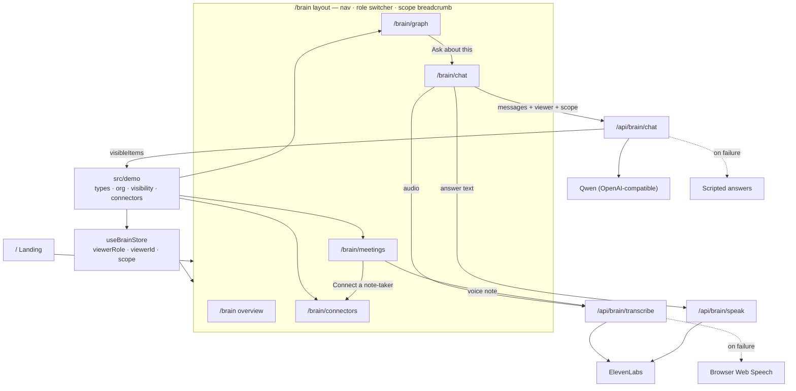

## Architecture: Brain Demo

```mermaid
graph TD
    Landing["/ Landing"] -->|Open the demo| Shell

    subgraph Shell["/brain layout — nav · role switcher · scope breadcrumb"]
        Overview["/brain overview"]
        Graph["/brain/graph"]
        Chat["/brain/chat"]
        Meetings["/brain/meetings"]
        Connectors["/brain/connectors"]
    end

    Store["useBrainStore<br/>viewerRole · viewerId · scope"] --> Shell
    Demo["src/demo<br/>types · org · visibility · connectors"] --> Store
    Demo --> Graph
    Demo --> Meetings
    Demo --> Connectors

    Chat -->|messages + viewer + scope| ChatAPI["/api/brain/chat"]
    Chat -->|audio| STT["/api/brain/transcribe"]
    Chat -->|answer text| TTS["/api/brain/speak"]
    Meetings -->|voice note| STT

    ChatAPI -->|visibleItems| Demo
    ChatAPI --> Qwen["Qwen (OpenAI-compatible)"]
    STT --> EL["ElevenLabs"]
    TTS --> EL

    ChatAPI -.->|on failure| Fallback["Scripted answers"]
    STT -.->|on failure| WebSpeech["Browser Web Speech"]

    Graph -->|Ask about this| Chat
    Meetings -->|Connect a note-taker| Connectors
```
