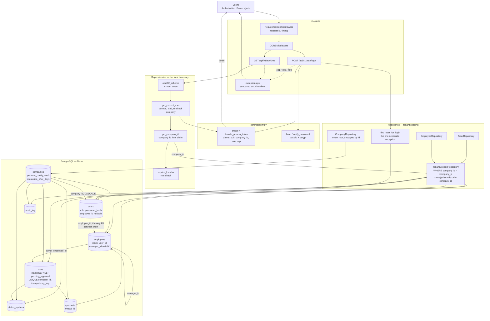

## Architecture: Database, Tenancy & Auth

The request path. `company_id` enters as a signed JWT claim, is resolved once by
`get_current_user`, and is injected into every query by the repository base class —
never read from a request body.

### The two things this diagram exists to show

**`company_id` has exactly one source.** It travels from the signed token through
`get_current_user` into the repository constructor. No route reads it from a body, query
param, or header, and `create()` discards it if a caller supplies one. The single
unscoped query, `find_user_for_login`, is unscoped because resolving the tenant is its
whole purpose — everything downstream uses the `company_id` it returns.

**`users` and `employees` are separate, linked one way.** Onboarding writes `employees`
before anyone has a login. The FK lives only on `users.employee_id`, so the two tables
cannot disagree about who is linked to whom.
