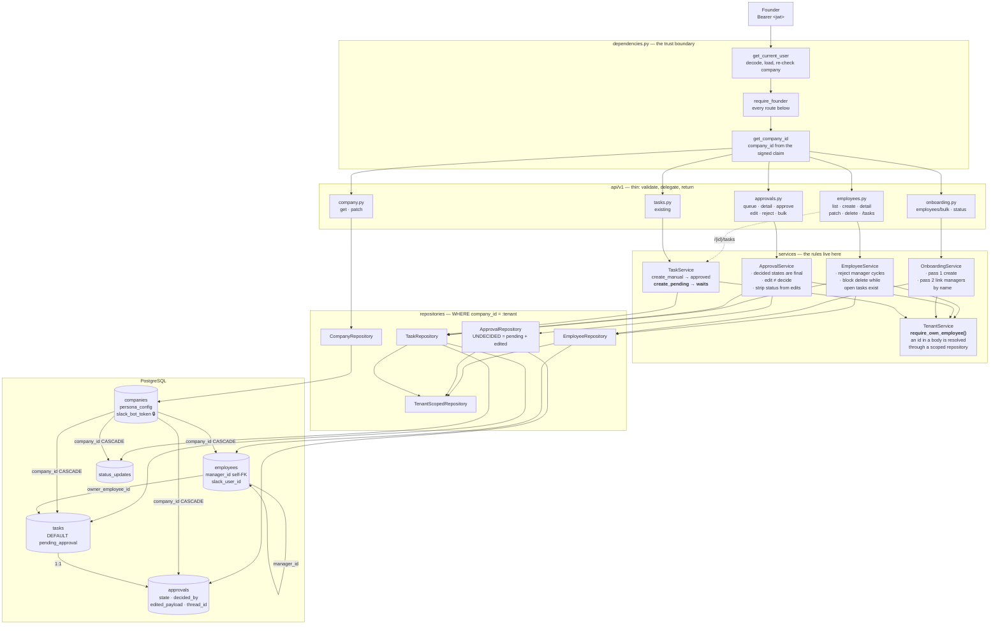
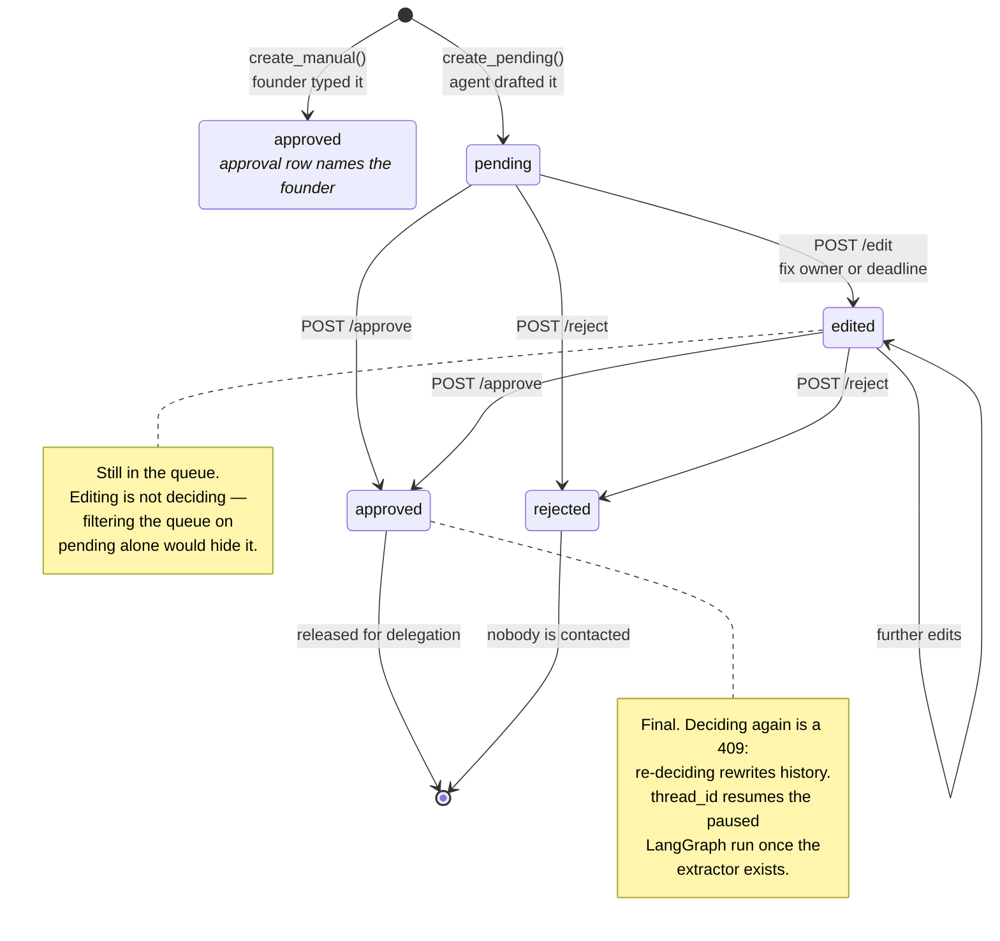

## Architecture: Employees, Approvals, Company & Onboarding endpoints

Two things this diagram exists to show: **every write passes the tenant guard in
`TenantService`**, and **the approval row is the single gate between a drafted task and
a delegated one**.

### The approval gate

Every task carries an approval row. Which one it gets is decided at creation, and that
is the whole of rule 1 — the state is never a model judgement.

