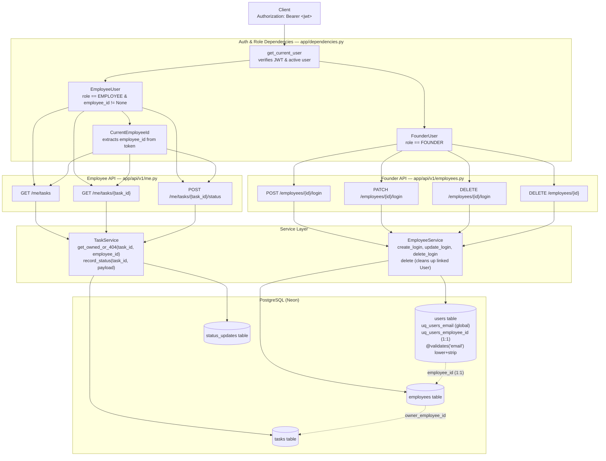

## Architecture: Employees as Users

The request paths and access boundaries for founder-managed employee accounts and employee-facing task reporting.

### Access Control & Security Invariants
1. **Deterministic Login:** `users.email` is globally unique and normalized to lowercase on model validation, ensuring single-tenant resolution during authentication.
2. **Founder Privilege:** Only `FounderUser` can provision, update, or delete employee logins.
3. **Employee Ownership Isolation:** `GET /me/tasks/{task_id}` and `POST /me/tasks/{task_id}/status` enforce ownership via `TaskService.get_owned_or_404`. Any attempt to access another employee's task returns `404 Task not found.` rather than confirming existence with a 403.
4. **Status Update Pinning:** `POST /me/tasks/{task_id}/status` automatically pins `reported_by_employee_id` to the token's `employee_id` and `reported_via` to `DASHBOARD`, preventing status attribution spoofing.
