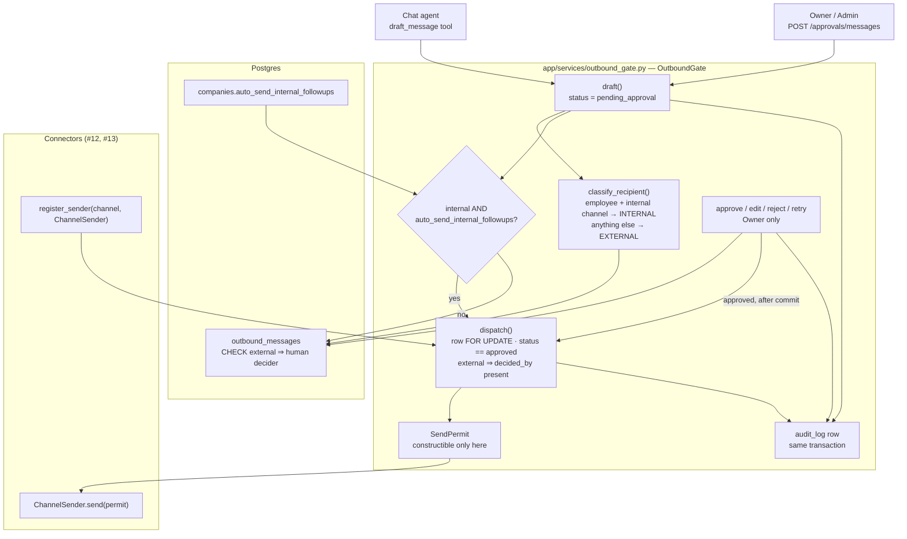

## Architecture: External Message Approval Gate

```mermaid
graph TD
    Agent["Chat agent<br/>draft_message tool"]
    Human["Owner / Admin<br/>POST /approvals/messages"]

    subgraph Gate["app/services/outbound_gate.py — OutboundGate"]
        Draft["draft()<br/>status = pending_approval"]
        Classify["classify_recipient()<br/>employee + internal channel → INTERNAL<br/>anything else → EXTERNAL"]
        Policy{"internal AND<br/>auto_send_internal_followups?"}
        Decide["approve / edit / reject / retry<br/>Owner only"]
        Dispatch["dispatch()<br/>row FOR UPDATE · status == approved<br/>external ⇒ decided_by present"]
        Permit["SendPermit<br/>constructible only here"]
        Audit["audit_log row<br/>same transaction"]
    end

    subgraph DB["Postgres"]
        Row["outbound_messages<br/>CHECK external ⇒ human decider"]
        Company["companies.auto_send_internal_followups"]
    end

    subgraph Connectors["Connectors (#12, #13)"]
        Registry["register_sender(channel, ChannelSender)"]
        Sender["ChannelSender.send(permit)"]
    end

    Agent --> Draft
    Human --> Draft
    Draft --> Classify --> Row
    Draft --> Policy
    Policy -- yes --> Dispatch
    Policy -- no --> Row
    Company --> Policy
    Decide --> Row
    Decide -- approved, after commit --> Dispatch
    Dispatch --> Permit --> Sender
    Registry --> Dispatch
    Draft & Decide & Dispatch --> Audit
```
