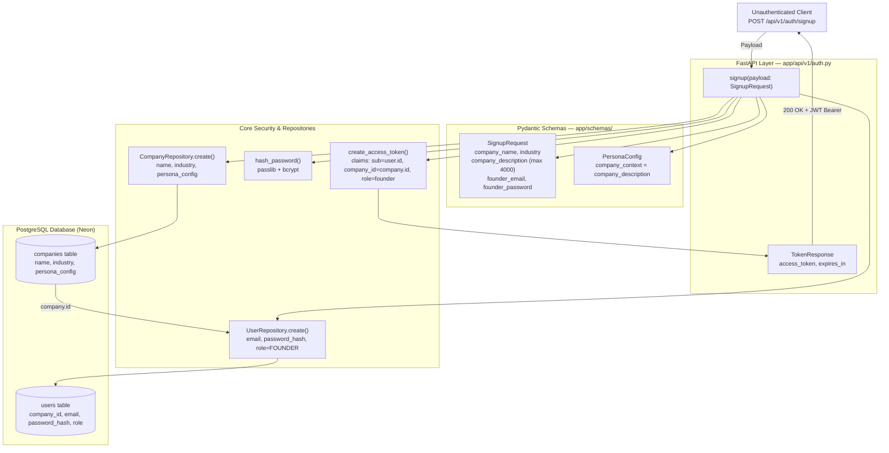

## Architecture: Founder Signup & Onboarding Entry Point

The signup flow provisions a new tenant (`Company`) and root account (`User` with `FOUNDER` role) in a single transactional write, issuing a JWT token for immediate authenticated onboarding.

### Key Takeaways
1. **Atomic Creation:** `Company` and founder `User` are flushed and committed together in one database transaction.
2. **Context Persistence:** `company_description` immediately populates `persona_config.company_context` for system prompt extraction.
3. **Immediate Onboarding:** The returned JWT token allows the client to call founder-gated endpoints (`POST /onboarding/employees/bulk`, `PATCH /company`) immediately without a secondary login call.
