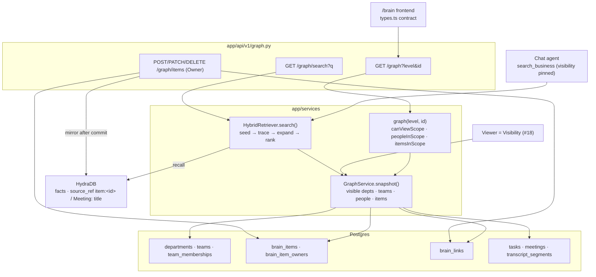

## Architecture: Graph API + Hybrid Retrieval

```mermaid
graph TD
    FE["/brain frontend<br/>types.ts contract"]
    Chat["Chat agent<br/>search_business (visibility pinned)"]

    subgraph API["app/api/v1/graph.py"]
        GetGraph["GET /graph?level&id"]
        Search["GET /graph/search?q"]
        Items["POST/PATCH/DELETE /graph/items (Owner)"]
    end

    Viewer["Viewer = Visibility (#18)"]

    subgraph Svc["app/services"]
        GS["GraphService.snapshot()<br/>visible depts · teams · people · items"]
        Scope["graph(level, id)<br/>canViewScope · peopleInScope · itemsInScope"]
        HR["HybridRetriever.search()<br/>seed → trace → expand → rank"]
    end

    subgraph PG["Postgres"]
        Org["departments · teams · team_memberships"]
        BI["brain_items · brain_item_owners"]
        BL["brain_links"]
        TM["tasks · meetings · transcript_segments"]
    end

    Hydra["HydraDB<br/>facts · source_ref item:&lt;id&gt; / Meeting: title"]

    FE --> GetGraph --> Scope --> GS
    Chat --> HR
    Search --> HR
    Viewer --> GS
    GS --> Org & BI & BL & TM
    HR --> GS
    HR -- recall --> Hydra
    Items --> BI & BL
    Items -- mirror after commit --> Hydra
```
