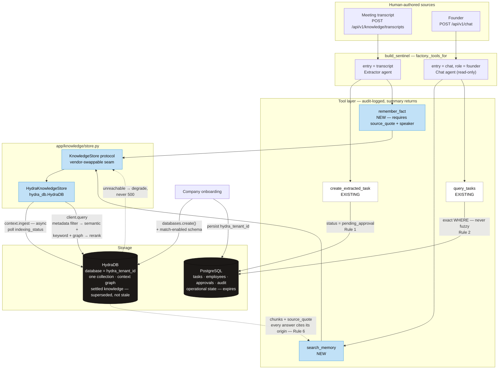
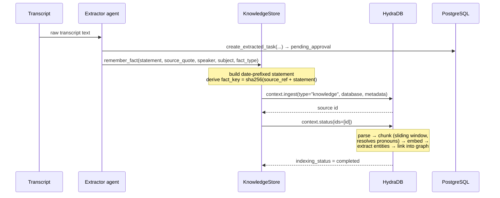
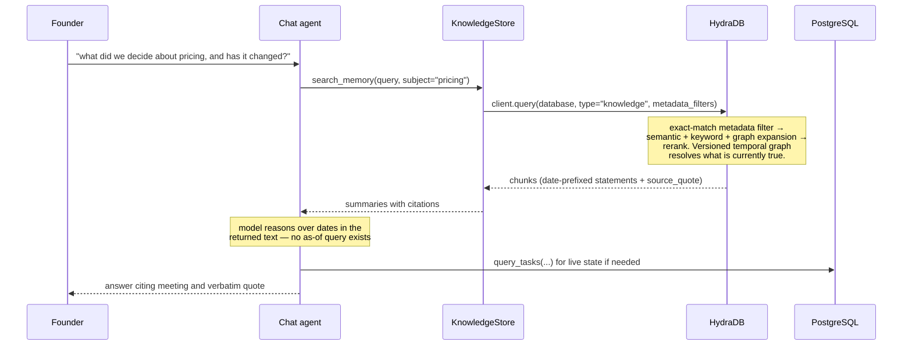

## Architecture: HydraDB Knowledge Layer

### Write path

### Read path

### Boundaries

| Concern | Owner | Rule |
|---|---|---|
| Task state, status, owners, approvals | PostgreSQL only | Rule 2 — never fuzzy retrieval |
| Decisions, facts, rationale, SOPs | HydraDB only | Does not expire; superseded, not stale |
| Which fact is currently true | HydraDB versioned temporal graph | Not rebuilt in Postgres |
| Tenant isolation | `database` per company | No cross-database aggregation |
| Source separation | `source_type` metadata | Never separate collections — fragments the graph |
| Provenance | `source_quote` + `speaker`, required at write | Rule 6 |
