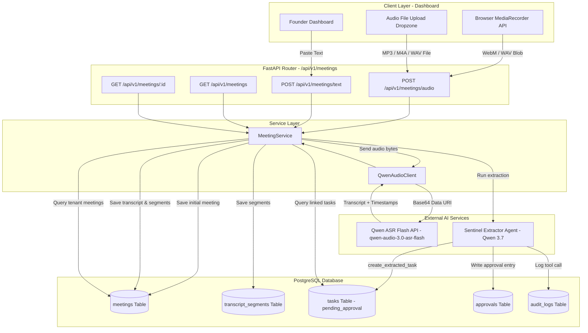

## Architecture: Meeting Transcription & Action Item Extraction Pipeline

```mermaid
graph TD
    subgraph Client [Client Layer - Dashboard]
        UI[Founder Dashboard]
        Recorder[Browser MediaRecorder API]
        FileDrop[Audio File Upload Dropzone]
    end

    subgraph API [FastAPI Router - /api/v1/meetings]
        AudioEndpoint[POST /api/v1/meetings/audio]
        TextEndpoint[POST /api/v1/meetings/text]
        ListEndpoint[GET /api/v1/meetings]
        DetailEndpoint[GET /api/v1/meetings/:id]
    end

    subgraph Services [Service Layer]
        MeetingSvc[MeetingService]
        ASRClient[QwenAudioClient]
    end

    subgraph External [External AI Services]
        QwenASR[Qwen ASR Flash API - qwen-audio-3.0-asr-flash]
        SentinelExtractor[Sentinel Extractor Agent - Qwen 3.7]
    end

    subgraph Storage [PostgreSQL Database]
        MeetingsTable[(meetings Table)]
        SegmentsTable[(transcript_segments Table)]
        TasksTable[(tasks Table - pending_approval)]
        ApprovalsTable[(approvals Table)]
        AuditLogsTable[(audit_logs Table)]
    end

    Recorder -->|WebM / WAV Blob| AudioEndpoint
    FileDrop -->|MP3 / M4A / WAV File| AudioEndpoint
    UI -->|Paste Text| TextEndpoint

    AudioEndpoint --> MeetingSvc
    TextEndpoint --> MeetingSvc

    MeetingSvc -->|Save initial meeting| MeetingsTable
    MeetingSvc -->|Send audio bytes| ASRClient
    ASRClient -->|Base64 Data URI| QwenASR
    QwenASR -->|Transcript + Timestamps| ASRClient
    ASRClient --> MeetingSvc

    MeetingSvc -->|Save transcript & segments| MeetingsTable
    MeetingSvc -->|Save segments| SegmentsTable

    MeetingSvc -->|Run extraction| SentinelExtractor
    SentinelExtractor -->|create_extracted_task| TasksTable
    SentinelExtractor -->|Write approval entry| ApprovalsTable
    SentinelExtractor -->|Log tool call| AuditLogsTable

    ListEndpoint --> MeetingSvc
    DetailEndpoint --> MeetingSvc
    MeetingSvc -->|Query tenant meetings| MeetingsTable
    MeetingSvc -->|Query linked tasks| TasksTable
```
