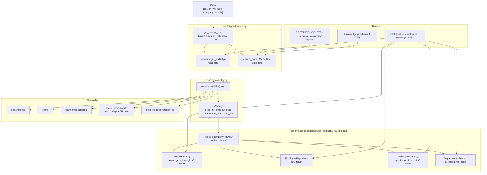

## Architecture: Owner / Admin / Member RBAC

```mermaid
graph TD
    Client["Client<br/>Bearer JWT {sub, company_id, role}"]

    subgraph Deps["app/dependencies.py"]
        CU["get_current_user<br/>tenant + active + role claim == row"]
        Viewer["Viewer = get_visibility()<br/>read gate"]
        Roles["require_roles / OwnerUser<br/>write gate"]
    end

    subgraph Vis["app/core/visibility.py"]
        Resolve["resolve_visibility(user)"]
        V["Visibility<br/>sees_all · employee_ids<br/>department_ids · team_ids"]
    end

    subgraph Org["Org tables"]
        Dept["departments"]
        Team["teams"]
        TM["team_memberships"]
        AA["admin_assignments<br/>user → dept XOR team"]
        Emp["employees.department_id"]
    end

    subgraph Repos["TenantScopedRepository(db, company_id, visibility)"]
        Filters["_filters(): company_id AND _visible_clause()"]
        TaskR["TaskRepository<br/>owner_employee_id ∈ reach"]
        EmpR["EmployeeRepository<br/>id ∈ reach"]
        MeetR["MeetingRepository<br/>speaker or cited task ∈ reach"]
        OrgR["Department / Team / Membership repos"]
    end

    subgraph Routes["Routes"]
        Reads["GET /tasks · /employees · /meetings · /org/*"]
        Writes["POST/PATCH/DELETE · /org writes · approvals · reports"]
        OwnerOnly["/knowledge/graph (until #20)"]
    end

    Client --> CU
    CU --> Viewer --> Resolve
    Resolve --> AA & Dept & Team & TM & Emp
    Resolve --> V
    CU --> Roles
    Reads --> Viewer
    Writes --> Roles
    OwnerOnly --> Roles
    V --> Filters
    Filters --> TaskR & EmpR & MeetR & OrgR
    Reads --> TaskR & EmpR & MeetR & OrgR
```
