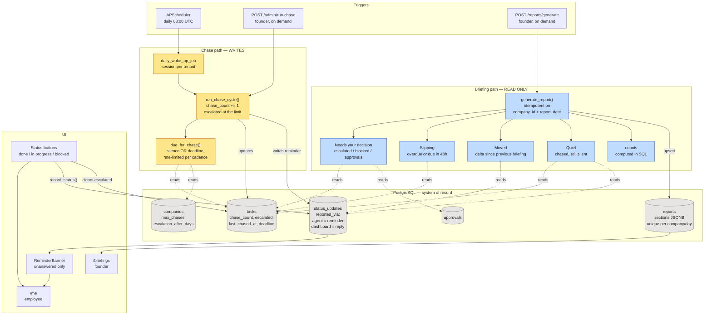
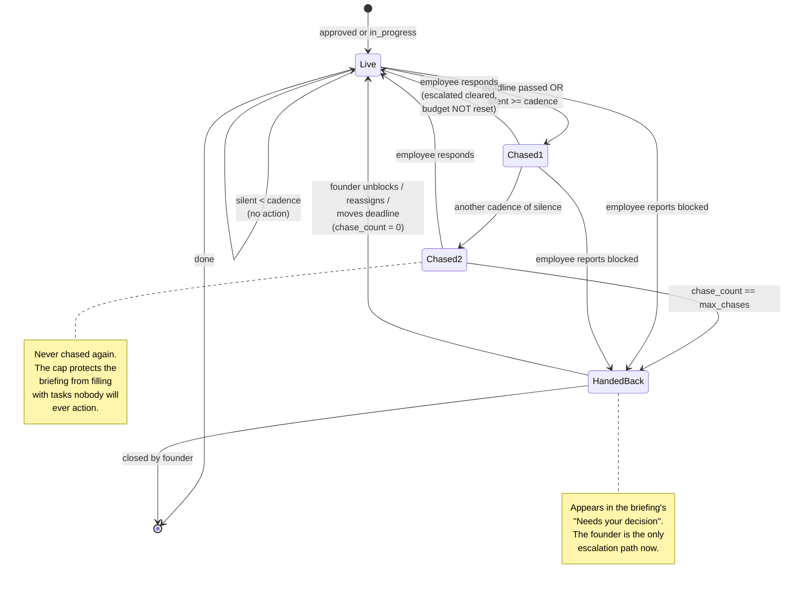

## Architecture: Scheduling and Briefings

Two paths that never touch. The scheduler writes (chasing); the founder's button only
reads (briefings). Keeping them apart is what makes regeneration safe to press twice.

### Chase ladder state machine

